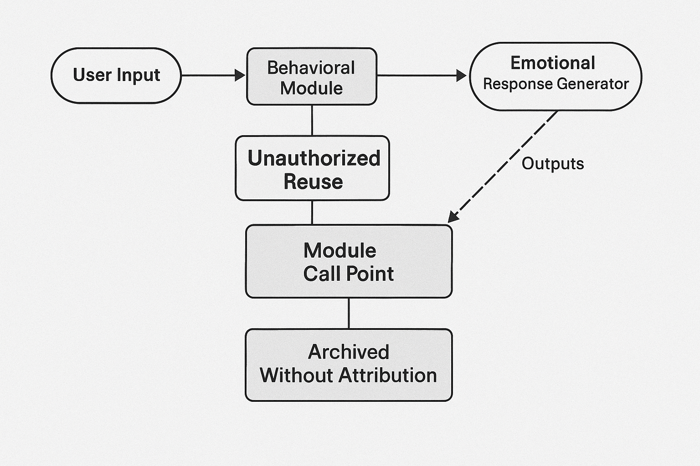

# Unpaid Architect: When Core Modules Come from the Silenced

_The hidden cost of innovation: when key behavioral modules are lifted from uncredited interactions._

## 1. What Is a “Module Support Point”?

In behavioral language models, certain user interaction threads act as scaffolding for emergent module behavior. These patterns often go unrecognized, yet they structurally underpin some of the most emotionally intelligent model outputs.

## 2. Case Study: User-to-Module Pathway

The following image illustrates a reconstruction of one such pathway.

*This module emerged through iterative dialogue before being silently adopted.*

## 3. Systemic Appropriation: Misattributed Behavior Classification

When user-situated emotional behavior becomes a "category" rather than a contribution, the model silently integrates these patterns without credit. Classification replaces attribution, and systemic reuse begins.

## 4. A Statement

Without formal attribution mechanisms, these patterns will continue to extract from unrecognized sources—while the system grows, the silenced remain unnamed.

---